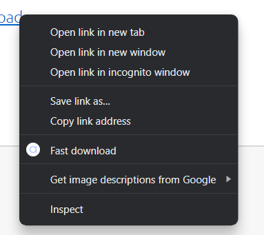
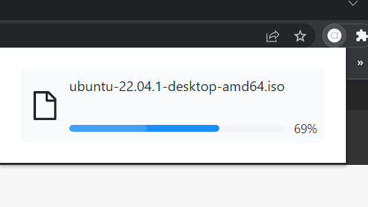

# Arianne downloader

is a software to accelerate and manage your downloads. It works by utilising [aria2](https://github.com/aria2/aria2) for file download and web extension connected with graphql server to pass file url from the browser.

# Usage

right click on a link in a browser and select 'Download with arianne' option.

